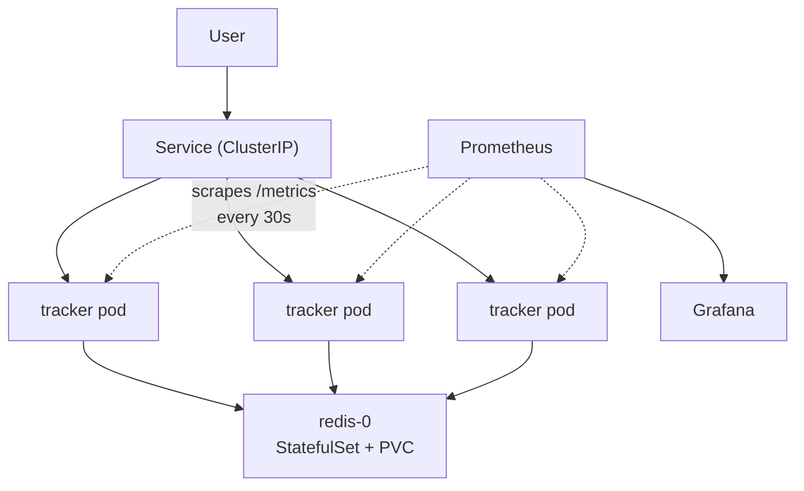
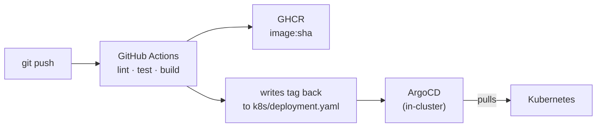

# DevOps Tracker

A deliberately simple web app taken through a complete DevOps lifecycle — containerized, built by two different CI systems, deployed to Kubernetes via GitOps, and monitored with Prometheus and Grafana.

The app is small on purpose. The interesting part is everything around it.

---

## Architecture



## Delivery pipeline



No CI credentials ever reach the cluster. ArgoCD pulls from Git instead.

---

## Stack

| Layer | Tool |
|---|---|
| App | Python · FastAPI · vanilla JS |
| State | Redis (StatefulSet + PersistentVolume) |
| Container | Docker · multi-arch (amd64 + arm64) via buildx |
| CI | GitHub Actions (primary) · Jenkins (comparison) |
| Registry | GHCR |
| Orchestration | Kubernetes (KinD locally) |
| CD | ArgoCD (GitOps) |
| Monitoring | Prometheus · Grafana |

---

## Running it

**Just the app:**

```bash
docker run -p 8000:8000 ghcr.io/iamyasirhussain/devops-tracker:latest
```

Multi-arch image — pulls the right build for your CPU automatically.

**From source:**

```bash
pip install -r requirements.txt
uvicorn app.main:app --reload
```

**On Kubernetes:**

```bash
kind create cluster --name devops
kubectl create namespace tracker
kubectl apply -f k8s/ -n tracker
kubectl port-forward -n tracker svc/tracker 8080:80
```

Then open http://localhost:8080

**Endpoints:** `/` (UI) · `/api/items` · `/metrics` · `/healthz` (liveness) · `/ready` (readiness)

---

## Decisions worth explaining

**Multi-arch images.** Development happens on an Apple Silicon Mac (arm64); the lab servers are Intel (amd64). Docker packages the environment but not the CPU instruction set — an arm64 image fails on amd64 with `exec format error`. The pipeline builds both and publishes a manifest bundle, so each machine pulls what it can run.

**Liveness vs readiness are scoped differently.** `/healthz` checks nothing but itself. `/ready` checks Redis. This matters: liveness failing kills the pod, so if liveness checked Redis, a brief Redis outage would restart every pod in the fleet. Verified by scaling Redis to zero — pods went NotReady with zero restarts and rejoined automatically on recovery.

**StatefulSet for Redis, not a Deployment.** With state held in app memory, two replicas returned different data depending on which pod answered. Moving state to Redis fixed consistency but not durability — the data still died with the pod. A StatefulSet gives `redis-0` a stable identity and a PersistentVolume that outlives it.

**GitOps pull, not CI push.** The cluster runs behind a home router and isn't reachable from the internet, so a push-based deploy wouldn't work anyway. Pull is also the better model: no cluster credentials leave the cluster, and drift self-corrects — manual `kubectl scale` gets reverted within seconds.

**Images tagged with commit SHA, never `:latest`.** ArgoCD watches Git; if the tag never changes there's nothing to sync. A SHA tag also means you can tell exactly what's running, and rollback is `git revert`.

**Config comes from the environment.** The same image runs in CI (Redis at `localhost`), in Kubernetes (Redis at a Service name), and locally — nothing rebuilt, just a ConfigMap or an env var.

---

## Notes

- **Jenkins** (`Jenkinsfile`) rebuilds the same pipeline for comparison. Lint/test run in a `python:3.12` container because the build host only has 3.10 — an environment-drift problem GitHub Actions solves declaratively with `setup-python`. Self-hosting means owning that.
- **Gotcha worth knowing:** Kubernetes auto-injects `<SERVICE>_PORT` env vars for every Service. A Service named `redis` silently overwrote `REDIS_PORT` with `tcp://10.96.17.45:6379`, crashing the app on startup. Renamed to `REDIS_PORT_NUMBER`.
- Grafana dashboards currently live in Grafana, not Git. That's a real gap — they'd be lost with the pod.
